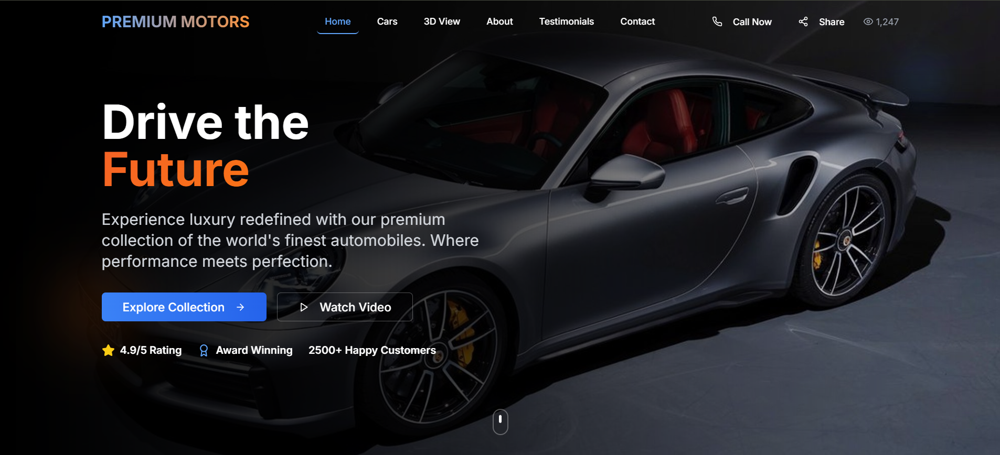
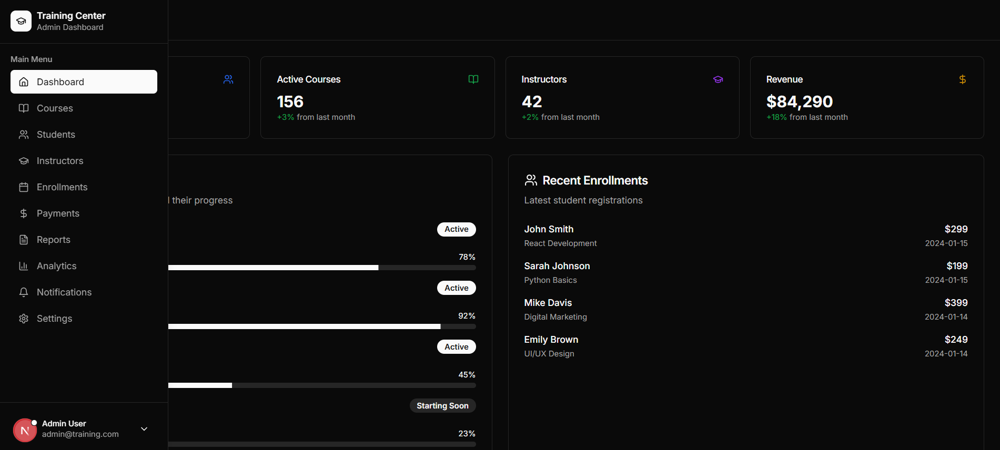
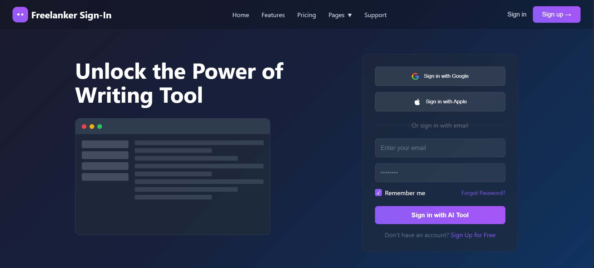
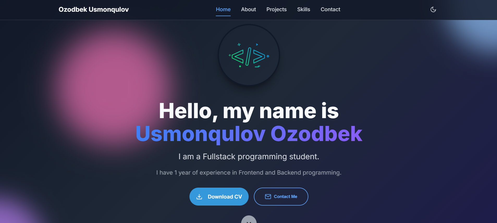

<h1 align="center">Salom 👋, Men Ozodbek Usmonqulov</h1>

  💻 Full Stack Developer | 🌐 Telegram bot yaratuvchisi | 🚀 Portfolio ishlab chiquvchisi

---

### 🧑‍💻 Men haqimda qisqacha

- 🌍 O‘zbekiston, Jizzax, Zomin shahridanman  
- 📚 Dasturlashni o‘rganishni va loyihalarda qo‘llashni yaxshi ko‘raman  
- 📈 1+ yillik frontend va backend tajribam bor  
- 🔭 Hozirda 3D web-saytlar, Telegram botlar va Django admin loyihalari ustida ishlayapman  
- 🧠 Sun’iy intellekt bilan ishlovchi ilovalarni ham yaratishni boshlaganman (OpenAI API, Telegram AI bot)

---

### 🛠️ Biladigan texnologiyalar

  

---

### 🗃️ Ma’lumotlar bazalari

- 📌 **PostgreSQL** — oddiy loyihalarda ishlatganman. Lekin profesional loyihalarda ishlatmaganman.  
- 📌 **MongoDB** — Malumotlar bazasini yaratib unga yangi narsa  qo'shib uni o'chrib yangisiga almashtirib ko'rganman.  

---

### 🤖 Telegram botlar (aiogram, python-telegram-bot)

| Bot nomi | Texnologiya | Tavsif | Havola |
|----------|-------------|--------|--------|
| `@news-bot` | Python, Aiogram | Yangiliklarni chiqaruvchi bot | [GitHub](https://github.com/username/news-bot) |
| `@ucstorm-bot` | Python, Aiogram, Click API | PubgMobile o'yiniga UC tushurish uchun qilingan bot | [GitHub](https://github.com/username/ucstorm-bot) |

> Botlar Click to‘lov tizimi, rasm yuborish, menyu yaratish, admin panelga ma’lumot yuborish kabi imkoniyatlarga ega.

---

## 💼 Portfolio loyihalarim

### 🚗 3D Car Website

**Texnologiyalar:** 

  

 
**Tavsif:** Bu sayt avtomobillar katalogi va 3D model sahifasini o‘z ichiga oladi. Foydalanuvchi mashinani aylantirib ko‘rishi va tafsilotlarini o‘qishi mumkin.  
🔗 [GitHub repository](https://github.com/Ozodbek-8486/Car-3D-web-sites)

---

### 📰 Admin-Dashboard

**Texnologiyalar:** TypeScript,CSS,JavaScript,Nextjs  
**Tavsif:** Bu loyiha admin panel asosida foydalanuvchilarni nzaorat qilish va to'lovlarni kuzatish uchun ishlab chiqilgan..  
🔗 [GitHub repository](https://github.com/ozodbek-8486/Admin-Dashboard)

---

### 👤 Login / Freelanker sign-In

**Texnologiyalar:** HTML, CSS, JavaScript  
**Tavsif:** Zamonaviy ranglarga ega login qismi. .  
🔗 [GitHub repository](https://github.com/ozodbek-8486/Frelanker-Sign-In)

---

### 🌐 Portfolio Sayt

**Texnologiyalar:** HTML, CSS, JavaScript  
**Tavsif:** Bu sayt mening portfolio ishim bo‘lib, unda loyihalarim, aloqa uchun havolalar, va men haqimdagi ma’lumotlar jamlangan.  
🔗 [GitHub repository](https://ozodbek-2008.uz/)

### 📫 Menga bog‘lanish

  

  
     
  

  

  

 

### 📊 GitHub statistikasi

### 📊 GitHub statistikasi

  
  

  

